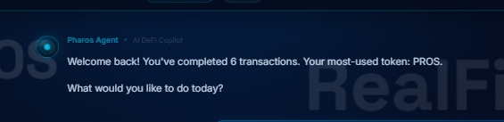
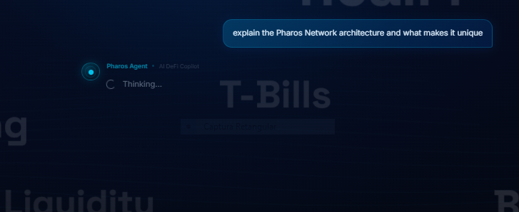
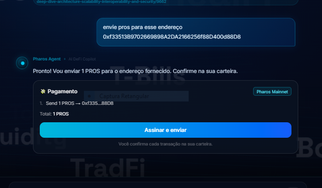

# 📖 Pharos Agent — Guia do Usuário / User Guide

> 🇧🇷 Português primeiro · 🇺🇸 [English below](#-english-user-guide)
>
> Versão interativa com imagens: abra **`/guide`** no site.

---

# 🇧🇷 Guia do Usuário (Português)

## 1. 🤖 O que é o Pharos Agent

O Pharos Agent é um **copiloto DeFi com IA** para a Pharos Network (Chain ID 1672). Você conversa em linguagem natural — em qualquer um de **30 idiomas** — e ele:

- Executa **swap**, **bridge**, **liquidez** e **envios de tokens** (você assina tudo na sua carteira);
- Analisa **qualquer carteira** (score, tokens, volumes, gás, protocolos);
- **Explica transações** a partir do hash, inclusive o motivo de falhas;
- Responde **qualquer pergunta** sobre a Pharos e o mundo cripto (DeFi, RWA, staking, NFTs…);
- Mostra **dados ao vivo**: preço do $PROS, notícias, tweets, campanhas e métricas da rede.

**100% não-custodial**: o agente nunca toca nas suas chaves. Ele apenas *propõe* transações — quem assina é você.

## 2. 🔗 Como conectar sua carteira

1. Instale uma carteira EVM: **MetaMask**, **OKX Wallet**, **Rabby**, **Bitget Wallet**…
2. Clique em **"Connect"** no canto superior direito do site.
3. Se tiver várias carteiras, escolha uma no seletor.
4. Aprove a conexão na janela da carteira.
5. Se a rede Pharos não estiver na carteira, o site pede para **adicionar automaticamente** (Chain ID 1672, RPC `rpc.pharos.xyz`, símbolo PROS). Aprove.
6. Pronto — endereço e saldo aparecem no topo.

> ⚠️ **O site NUNCA pede sua seed phrase ou chave privada.** Se algo pedir, é golpe.

## 3. 🌐 Redes: Mainnet × Atlantic Testnet

Use o **seletor de rede** no canto do site. O agente avisa no chat o que funciona em cada rede:

| | Pharos Mainnet | Atlantic Testnet |
|---|---|---|
| Chain ID | 1672 | 688689 |
| Token | PROS | PHRS |
| Swap / Bridge / Liquidez | ✅ | ❌ (contratos só na mainnet) |
| Enviar tokens | ✅ | ✅ (PHRS) |
| Análise de carteira / Explicar tx | ✅ | ✅ |

Faucets de PHRS grátis: `testnet.pharosnetwork.xyz` · `stakely.io/faucet/pharos-atlantic-testnet-phrs`

## 4. 💬 Conversando com o agente

Escreva naturalmente — ele detecta o idioma e responde no mesmo. Exemplos:

- `explique a arquitetura da Pharos Network`
- `o que é impermanent loss?`
- `qual a diferença entre APR e APY?`
- `quais protocolos RWA existem na Pharos?`
- `qual o preço do PROS agora?`
- `quais campanhas estão ativas?`

## 5. ⇄ Swap

Diga `troca 5 PROS por USDC` ou apenas `quero fazer um swap`. O assistente guiado mostra seus **saldos ao vivo**, deixa digitar o valor ou usar **25/50/75/100%**, e compara as rotas (**FaroSwap** e **LI.FI**) destacando o melhor retorno.

## 6. 🌉 Bridge

`faz bridge de 20 USDC para a Base` — o assistente pergunta o que faltar e compara os provedores (**LI.FI/Jumper**, **Chainlink CCIP**, **Circle CCTP v2** para USDC) com o retorno estimado de cada. Chains: Ethereum, Base, Arbitrum, Polygon.

## 7. 💧 Liquidez (FaroSwap V3)

`adicionar liquidez` — escolha o **fee tier** (0.01% a 1%), a **faixa de preço** (±5/10/20%, completa ou % personalizado) e o valor, vendo o USDC correspondente pelo preço real da pool. Depois: `mostra minhas posições LP`, `remove 50% da posição`, `coleta as taxas`.

## 8. 💸 Enviar tokens

- `envie 2 PROS para 0xAbC…` → cartão de pagamento instantâneo;
- `envie pros para 0xAbC…` (sem valor) → **o agente pergunta quanto**, mostrando seu saldo com botões de %;
- Lote: `manda 1 PROS pro 0xAAA… e 2 PROS pro 0xBBB…`;
- Testnet: mesmo formato com PHRS.

> ⚠️ **Confira endereço e valor na carteira antes de assinar.** Transações são irreversíveis.

## 9. ✅ Aprovações ERC-20

`aprova 100 USDC para 0xContrato…`. Prefira valor **exato**; aprovação **ilimitada** permite que um contrato comprometido drene todo o saldo daquele token — revogue allowances antigas (ex.: revoke.cash).

## 10. 🧠 Inteligência de carteira

No chat (`qual o score da minha carteira?`, `analisa a carteira 0x…`, `minhas posições RealFi`, `compara 0xA… e 0xB…`) ou na página **Wallet**: score 0-100 em 6 categorias, todos os tokens com saldos ao vivo, volume por token (entrada/saída), tipos de movimentação (swaps, bridges, liquidez…), gás gasto, timeline e protocolos.

## 11. 🔎 Explicador de transações

Cole qualquer **hash** (0x + 64 caracteres) no chat. O agente explica em linguagem simples — e, se a tx falhou, decodifica o **motivo exato do revert**. Funciona na mainnet e na testnet.

## 12. 🗂️ Páginas do site

**Chat** · **Wallet** (análise completa) · **Ecosystem** (40+ dApps) · **Trade** (preço/gráfico do $PROS) · **Campaigns** (campanhas ativas) · **News** (notícias + tweets com arquivo permanente) · **Network** (métricas ao vivo) · **Guide** (este guia).

## 13. 🛠️ Skill APIs públicas (devs)

- `POST /api/skill/wallet-profile` — `{ address }` → saldo, txs, perfil IA
- `POST /api/skill/wallet-score` — `{ address }` → score, categorias, volumes, holdings
- `POST /api/skill/explain-tx` — `{ hash, network? }` → explicação em linguagem simples

## 14. 🛡️ Segurança

1. **Não-custodial** — o agente nunca acessa suas chaves; toda tx é assinada por você.
2. **Nunca compartilhe** seed phrase/chave privada. Suporte real nunca chama no privado.
3. **Confira na carteira** endereço, valor e contrato ANTES de assinar.
4. Prefira **aprovações exatas**; revogue allowances antigas.
5. Use **links oficiais**: pharos.xyz · port.pharos.xyz · docs.pharos.xyz.
6. **Comece pequeno** ao testar fluxos novos.
7. Respostas do agente são **informativas, não aconselhamento financeiro**.

## 15. 💡 Dicas

`cancelar` aborta qualquer fluxo · **Quick Actions** na barra lateral · **↺ New chat** reinicia · **⌂ Home** volta ao início · gírias e erros de digitação funcionam · preços/notícias/campanhas usam dados ao vivo.

---

# 🇺🇸 English User Guide

## 1. 🤖 What is Pharos Agent

Pharos Agent is an **AI DeFi copilot** for the Pharos Network (Chain ID 1672). You chat in natural language — in any of **30 languages** — and it:

- Executes **swaps**, **bridges**, **liquidity** and **token transfers** (you sign everything in your wallet);
- Analyzes **any wallet** (score, tokens, volumes, gas, protocols);
- **Explains transactions** from a hash, including why they failed;
- Answers **any question** about Pharos and the crypto world (DeFi, RWA, staking, NFTs…);
- Shows **live data**: $PROS price, news, tweets, campaigns and network metrics.

**100% non-custodial**: the agent never touches your keys. It only *proposes* transactions — you sign them.

## 2. 🔗 How to connect your wallet

1. Install an EVM wallet: **MetaMask**, **OKX Wallet**, **Rabby**, **Bitget Wallet**…
2. Click **"Connect"** in the top-right corner of the site.
3. If you have several wallets, choose one in the picker.
4. Approve the connection in the wallet popup.
5. If the Pharos network isn't in your wallet, the site asks to **add it automatically** (Chain ID 1672, RPC `rpc.pharos.xyz`, symbol PROS). Approve it.
6. Done — your address and balance appear at the top.

> ⚠️ **The site NEVER asks for your seed phrase or private key.** If anything does, it's a scam.

## 3. 🌐 Networks: Mainnet × Atlantic Testnet

Use the **network switcher** in the corner of the site. The agent announces in the chat what works on each network:

| | Pharos Mainnet | Atlantic Testnet |
|---|---|---|
| Chain ID | 1672 | 688689 |
| Token | PROS | PHRS |
| Swap / Bridge / Liquidity | ✅ | ❌ (contracts are mainnet-only) |
| Send tokens | ✅ | ✅ (PHRS) |
| Wallet analysis / Explain tx | ✅ | ✅ |

Free PHRS faucets: `testnet.pharosnetwork.xyz` · `stakely.io/faucet/pharos-atlantic-testnet-phrs`

## 4. 💬 Talking to the agent

Write naturally — it detects your language and replies in it. Examples:

- `explain the Pharos Network architecture`
- `what is impermanent loss?`
- `what's the difference between APR and APY?`
- `which RWA protocols exist on Pharos?`
- `what's the PROS price right now?`
- `which campaigns are active?`

## 5. ⇄ Swap

Say `swap 5 PROS for USDC` or just `I want to make a swap`. The guided wizard shows your **live balances**, lets you type an amount or use **25/50/75/100%**, and compares routes (**FaroSwap** and **LI.FI**) highlighting the best return.

## 6. 🌉 Bridge

`bridge 20 USDC to Base` — the wizard asks for anything missing and compares providers (**LI.FI/Jumper**, **Chainlink CCIP**, **Circle CCTP v2** for USDC) with each estimated return. Chains: Ethereum, Base, Arbitrum, Polygon.

## 7. 💧 Liquidity (FaroSwap V3)

`add liquidity` — pick the **fee tier** (0.01% to 1%), the **price range** (±5/10/20%, full range or a custom %) and the amount, seeing the matching USDC at the live pool price. Then: `show my LP positions`, `remove 50% of the position`, `collect fees`.

## 8. 💸 Sending tokens

- `send 2 PROS to 0xAbC…` → instant payment card;
- `send pros to 0xAbC…` (no amount) → **the agent asks how much**, showing your balance with % buttons;
- Batch: `send 1 PROS to 0xAAA… and 2 PROS to 0xBBB…`;
- Testnet: same format with PHRS.

> ⚠️ **Check the address and amount in your wallet before signing.** Transactions are irreversible.

## 9. ✅ ERC-20 approvals

`approve 100 USDC for 0xContract…`. Prefer **exact** amounts; an **unlimited** approval lets a compromised contract drain your whole balance of that token — revoke old allowances (e.g. revoke.cash).

## 10. 🧠 Wallet intelligence

In the chat (`what's my wallet score?`, `analyze wallet 0x…`, `my RealFi positions`, `compare 0xA… and 0xB…`) or on the **Wallet** page: 0-100 score across 6 categories, every token with live balances, volume per token (in/out), movement types (swaps, bridges, liquidity…), gas spent, timeline and protocols.

## 11. 🔎 Transaction explainer

Paste any **hash** (0x + 64 characters) in the chat. The agent explains it in plain language — and if the tx failed, it decodes the **exact revert reason**. Works on mainnet and testnet.

## 12. 🗂️ Site pages

**Chat** · **Wallet** (full analysis) · **Ecosystem** (40+ dApps) · **Trade** ($PROS price/chart) · **Campaigns** (active campaigns) · **News** (news + tweets with a permanent archive) · **Network** (live metrics) · **Guide** (this guide).

## 13. 🛠️ Public Skill APIs (devs)

- `POST /api/skill/wallet-profile` — `{ address }` → balance, txs, AI profile
- `POST /api/skill/wallet-score` — `{ address }` → score, categories, volumes, holdings
- `POST /api/skill/explain-tx` — `{ hash, network? }` → plain-language explanation

## 14. 🛡️ Security

1. **Non-custodial** — the agent never accesses your keys; every tx is signed by you.
2. **Never share** your seed phrase/private key. Real support never DMs first.
3. **Check in your wallet** the address, amount and contract BEFORE signing.
4. Prefer **exact approvals**; revoke old allowances.
5. Use **official links**: pharos.xyz · port.pharos.xyz · docs.pharos.xyz.
6. **Start small** when testing new flows.
7. The agent's answers are **informational, not financial advice**.

## 15. 💡 Tips

`cancel` aborts any flow · **Quick Actions** in the sidebar · **↺ New chat** restarts · **⌂ Home** goes back · slang and typos work fine · prices/news/campaigns use live data.
